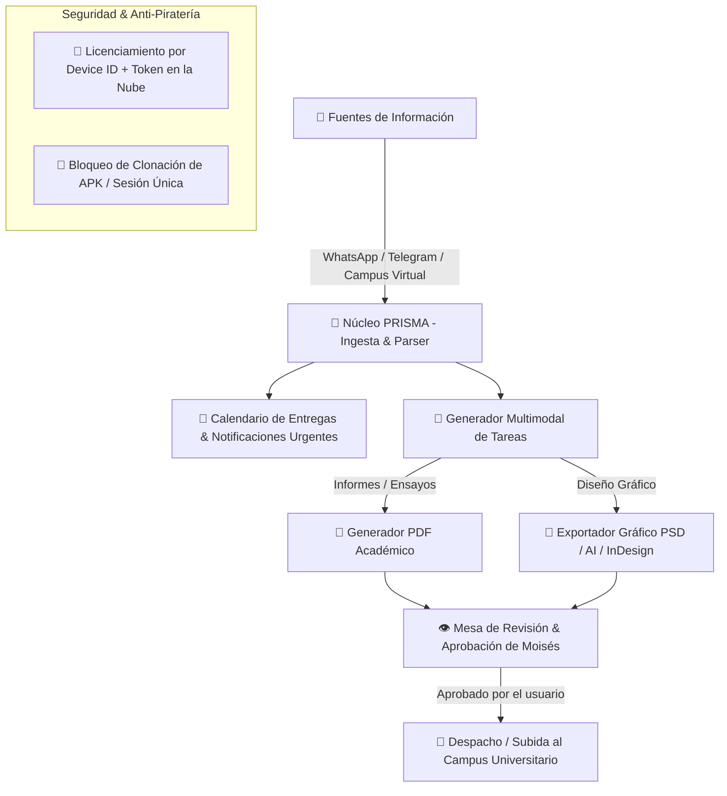

# 🔮 PROYECTO PRISMA
### Plataforma Resolutiva de Inteligencia y Seguimiento Multimodal Académico

> **Misión:** Asistente autónomo de gestión académica, detección de consignas en WhatsApp/Telegram/Campus Virtual, generación multimodal de entregables (PDFs, PSD, Illustrator, InDesign), flujo de revisión humana y licenciamiento protegido contra distribución no autorizada.

---

## 🏛️ Visión Arquitectónica

---

## 🧩 Módulos Principales

### 1. Ingesta y Monitoreo Inteligente
- **Conexión con Campus Virtual:** Monitoreo periódico de tareas publicadas, calificaciones y fechas límites.
- **Canales de Mensajería (Telegram & WhatsApp):** Webhook / lector de resúmenes de grupos para capturar instrucciones enviadas por profesores en chats colectivos.
- **Alertas Predictivas:** Notificaciones tempranas con semáforo de urgencia (rojo: 24h, amarillo: 72h, verde: >5 días).

### 2. Generador Multimodal de Entregables
- **Textos Académicos:** Ensayos, monografías, presentaciones e investigaciones formateadas automáticamente en PDF con normas estándar (APA 7ma / Vancouver).
- **Diseño Gráfico y Maquetación:**
  - **Adobe Photoshop (`.psd`):** Generación de layouts, capas inteligentes, mockups y tarjetas de diseño.
  - **Adobe Illustrator (`.ai` / `.svg`):** Vectores, identidad visual, afiches e infografías escalables.
  - **Adobe InDesign (`.idml` / `.pdf` interactivo):** Maquetación editorial de folletos, revistas, trípticos y catálogos.

### 3. Flujo "Human in the Loop" (Revisión de Moisés)
- La plataforma **nunca** sube una tarea a ciegas:
  1. PRISMA genera el paquete completo del entregable.
  2. Notifica a Moisés con vista previa descargable.
  3. Moisés puede pulsar **Aprobar y Enviar** o solicitar **Ajustes específicos**.
  4. Al recibir la confirmación de Moisés, PRISMA realiza el envío a la plataforma universitaria.

### 4. Modelo de Licenciamiento y Protección Comercial (Anti-Piratería)
- **Zero-Local Secret:** La inteligencia y los procesadores pesados residen en el backend (API protegida). Si un estudiante copia o extrae el APK, no contiene la lógica ni las llaves.
- **Device Fingerprint / HWID:** La licencia se enlaza al identificador único de hardware del teléfono o PC.
- **Validación de Token Activo:** Si el APK se comparte a otro dispositivo, el servidor detecta el cambio de hardware y bloquea el acceso inmediatamente pidiendo activación con clave de compra.

---

## 🎯 Próximos Pasos Técnicos
1. Identificar la plataforma de la universidad (Moodle, Canvas, Blackboard, portal propietario).
2. Definir la tecnología frontend (PWA / React Native / Flutter / Web App de alto rendimiento).
3. Configurar el backend seguro y el pipeline de generación de documentos y diseño.
