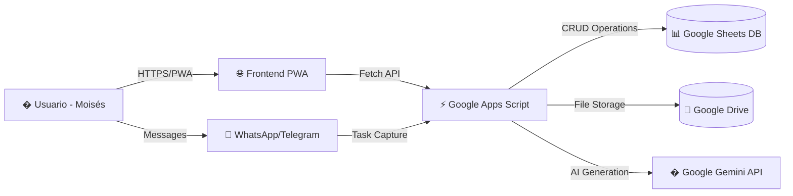

# 🔮 PROYECTO PRISMA v3.0
### Plataforma Resolutiva de Inteligencia y Seguimiento Multimodal Académico

> **Misión:** Asistente autónomo de gestión académica, detección de consignas en WhatsApp/Telegram/Campus Virtual, generación multimodal de entregables (PDFs, Word, SVG, JSX), flujo de revisión humana y sincronización en la nube.

---

## 🚀 Estado Actual: COMPLETAMENTE FUNCIONAL

PRISMA v3.0 ha sido completamente actualizado con arquitectura **serverless-sheets-pwa**:

- ✅ **Google Sheets** como base de datos
- ✅ **Google Apps Script** como backend API
- ✅ **Frontend PWA** instalable con modo offline
- ✅ **Integración IA Gemini** para generación de contenido
- ✅ **Sistema de calendario** con prioridades automáticas
- ✅ **Integración WhatsApp/Telegram** para captura de tareas
- ✅ **Diseño cyberpunk académico** basado en Creaciones JJ

---

## 🏛️ Arquitectura del Sistema



---

## 📦 Estructura del Proyecto

```
proyecto-prisma/
├── index.html                    # Frontend principal (PWA)
├── app.js                        # Lógica SPA, modales, gestión de estado
├── styles.css                    # Estilos cyberpunk académicos
├── Code.gs                       # Backend Google Apps Script
├── sw.js                         # Service Worker (PWA + offline)
├── manifest.webmanifest           # Configuración PWA
├── INICIALIZADOR_AUTOMATICO.gs   # Script para crear Google Sheets
├── SETUP_COMPLETO.md             # Guía detallada de configuración
├── PRUEBA_SISTEMA.md             # Checklist de verificación
├── ESTRUCTURA_SHEETS.md          # Documentación de base de datos
└── README.md                     # Este archivo
```

---

## 🎯 Comenzar Rápidamente (3 Pasos)

### 1️⃣ Configurar Google Sheets
```bash
# Sigue estos pasos:
1. Abre https://sheets.new
2. Ve a Extensiones > Apps Script
3. Copia el contenido de INICIALIZADOR_AUTOMATICO.gs
4. Ejecuta la función inicializarPrismaCompleto()
5. Reemplaza el código con el de Code.gs
6. Despliega como Web App y copia la URL
```

### 2️⃣ Conectar Frontend
```bash
# En PRISMA:
1. Abre index.html en tu navegador
2. Inicia sesión (Moisés / 123456)
3. Ve a Ajustes > Conexión Backend
4. Pega la URL de la Web App
5. Guarda y recarga datos
```

### 3️⃣ Configurar IA (Opcional)
```bash
# Para generación avanzada:
1. Ve a https://aistudio.google.com/app/apikey
2. Crea una API key gratuita
3. En PRISMA > Estudio, conecta la key
4. ¡Listo para generar contenido académico!
```

📖 **Guía completa:** Lee [`SETUP_COMPLETO.md`](SETUP_COMPLETO.md) para instrucciones detalladas.

---

## 🧩 Módulos Principales

### 📡 Radar Académico
- Monitoreo de tareas con prioridades automáticas
- Sistema de semáforo (rojo: <24h, amarillo: <72h, verde: >5 días)
- Filtros por estado, prioridad y búsqueda
- Integración directa con calendario

### 🎨 Estudio Multimodal (IA)
- **Motor Google Gemini 2.5 Flash** para generación avanzada
- **Motor heurístico local** como respaldo
- Generación de: PDF académico, Word editable, SVG vectorial, Script Photoshop
- Formato automático con normas APA 7ma
- Human-in-the-loop: revisión antes de envío

### 📅 Calendario Académico
- Vista mensual interactiva
- Creación de eventos (tareas, exámenes, clases)
- Recordatorios automáticos
- Sincronización con tareas del Radar

### 💬 Canales de Mensajería
- Integración con **WhatsApp** y **Telegram**
- Captura automática de tareas desde grupos
- Procesamiento inteligente de mensajes
- Detección de palabras clave académicas

### 📚 Gestión de Materias
- Registro de cursos inscritos
- Información de profesores y horarios
- Codificación por colores
- Sincronización con campus (simulado)

### ⚙️ Sistema de Configuración
- Conexión con backend serverless
- Gestión de API keys
- Personalización de temas (oscuro/claro)
- Copias de seguridad y restauración

---

## 🔧 Tecnologías Utilizadas

### Frontend
- **Vanilla JavaScript** (SPA sin frameworks pesados)
- **CSS3 Moderno** con variables y efectos glassmorphism
- **SweetAlert2** para modales elegantes
- **FontAwesome 6** para iconos
- **Google Fonts** (Inter + JetBrains Mono)

### Backend
- **Google Apps Script** (Node.js en la nube de Google)
- **Google Sheets API** (CRUD operations)
- **Google Drive API** (almacenamiento de archivos)
- **Google Gemini API** (generación con IA)

### PWA
- **Service Worker** con estrategias avanzadas de caché
- **Manifest Web App** con shortcuts y categorías
- **Soporte offline** completo
- **Instalación** en escritorio y móvil

---

## 🎨 Características del Diseño

### Estética Cyberpunk Académico
- **Paleta prismática:** Cyan neon (#00f0ff), Violet eléctrico (#9333ea)
- **Fondo oscuro:** Base abisal (#070a12) con gradientes sutiles
- **Efectos glassmorphism:** Transparencias y blur modernos
- **Tipografía:** Inter (UI) + JetBrains Mono (código)

### Responsive Design
- **Mobile-first:** Optimizado para smartphones
- **Desktop adaptativo:** Grid bento para pantallas grandes
- **Navegación táctil:** Bottom nav para móviles
- **Accesibilidad:** Alto contraste y textos legibles

---

## 📊 Funcionalidades Destacadas

### 🤖 Generación con IA
```javascript
// Ejemplo de uso:
1. Pega las pautas de una tarea en Estudio
2. PRISMA analiza con Gemini 2.5 Flash
3. Genera estructura académica completa
4. Descarga PDF con normas APA, Word editable, SVG, JSX
5. Envía al Radar para seguimiento
```

### 🔄 Sincronización Inteligente
```javascript
// Modo híbrido:
- Online: Sincronización en tiempo real con Google Sheets
- Offline: Funcionamiento completo con localStorage
- Reconexión: Sincronización automática de datos pendientes
```

### 📱 PWA Instalable
```javascript
// Características:
- Instalación en escritorio y móvil
- Funcionamiento sin conexión
- Atajos de teclado (Ctrl+K para spotlight)
- Notificaciones push (preparado para futuro)
```

---

## 🛡️ Seguridad y Privacidad

### Datos del Usuario
- **LocalStorage:** Credenciales y preferencias locales
- **Google Sheets:** Base de datos encriptada en la nube
- **Sin cookies de terceros:** Privacidad mejorada
- **Sin tracking:** No hay analytics externos

### API Keys
- **Almacenamiento local:** Las API keys se guardan solo en tu navegador
- **Nunca en el servidor:** Tu clave de Gemini nunca viaja al backend
- **Opcional:** El sistema funciona sin IA (modo local)

---

## 📚 Documentación Adicional

- **[`SETUP_COMPLETO.md`](SETUP_COMPLETO.md)** - Guía paso a paso para configuración
- **[`PRUEBA_SISTEMA.md`](PRUEBA_SISTEMA.md)** - Checklist de verificación y pruebas
- **[`ESTRUCTURA_SHEETS.md`](ESTRUCTURA_SHEETS.md)** - Documentación de base de datos
- **[`INICIALIZADOR_AUTOMATICO.gs`](INICIALIZADOR_AUTOMATICO.gs)** - Script de automatización

---

## 🆘 Soporte y Solución de Problemas

### Problemas Comunes

**Error de conexión con backend:**
- Verifica que la URL de la Web App sea correcta
- Asegúrate de que esté configurada como "Cualquiera"
- Revisa la consola del navegador (F12)

**Service Worker no funciona:**
- Verifica que sirvas sobre HTTPS o localhost
- Desactiva y reactiva el SW en DevTools
- Limpia la caché del navegador

**API de Gemini falla:**
- Verifica que la API key sea correcta
- Asegúrate de tener cuota disponible
- El sistema usará modo local automáticamente si falla

---

## 🎯 Roadmap Futuro

### v3.1 (Corto plazo)
- [ ] Sincronización real con Moodle UNICA
- [ ] Notificaciones push para tareas urgentes
- [ ] Exportación a calendario Google/Outlook
- [ ] Modo colaborativo para grupos de estudio

### v4.0 (Mediano plazo)
- [ ] App nativa (React Native / Flutter)
- [ ] Integración con Google Calendar API
- [ ] Análisis de rendimiento académico
- [ ] Gamificación y logros

### v5.0 (Largo plazo)
- [ ] Asistente de voz completo
- [ ] Generación de presentaciones interactivas
- [ ] Integración con plataformas de videoconferencia
- [ ] Sistema de recomendación de recursos

---

## 📄 Licencia

Proyecto académico personal para Moisés González - Universidad Católica Cecilio Acosta (UNICA).

**⚠️ Nota:** Este sistema es para uso personal y educativo. No está destinado para distribución comercial sin autorización explícita.

---

## 🙏 Agradecimientos

Este proyecto se inspira en la arquitectura exitosa de **Creaciones JJ** (sistema de gestión de producción) y utiliza las mejores prácticas de **serverless-sheets-pwa** para crear una solución robusta, escalable y sin costos de infraestructura.

---

**¿Listo para transformar tu vida académica?** 🚀

Comienza siguiendo la guía en [`SETUP_COMPLETO.md`](SETUP_COMPLETO.md) y tendrás tu asistente académico funcionando en menos de 10 minutos.
